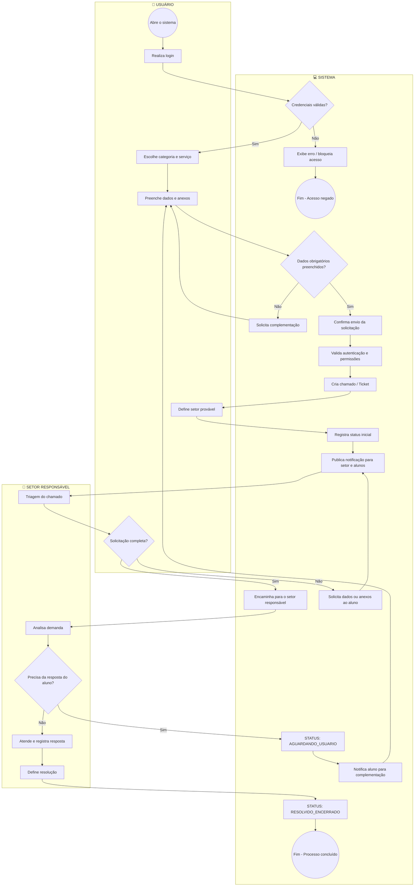

# Fluxo de Abertura e Atendimento de Chamados

Este documento descreve o processo representado no diagrama BPMN original (`BPMN_Projet.drawio`), organizado em três raias (*swimlanes*): **Usuário**, **Sistema** e **Setor Responsável**.

## Diagrama

> **Nota:** no diagrama original, a tarefa *"Triagem do chamado"* (raia Setor Responsável) conecta-se diretamente à decisão *"Solicitação completa?"* (raia Usuário), em vez de seguir para *"Analisa demanda"*. Essa ligação foi preservada fielmente aqui; vale confirmar se ela reflete a intenção real do processo ou se é um ajuste pendente no diagrama.

## Etapas por raia

### 👤 Usuário

| Etapa | Tipo | Descrição |
|---|---|---|
| Abre o sistema | Evento de início | Usuário inicia o acesso ao sistema |
| Realiza login | Tarefa | Informa credenciais de acesso |
| Escolhe categoria e serviço | Tarefa | Seleciona o tipo de solicitação |
| Preenche dados e anexos | Tarefa | Preenche formulário e anexa documentos |
| Define setor provável | Tarefa | Sistema/usuário indica o setor provável de destino |
| Solicitação completa? | Decisão | Verifica se a triagem considerou a solicitação completa |

### 💻 Sistema

| Etapa | Tipo | Descrição |
|---|---|---|
| Credenciais válidas? | Decisão | Valida login informado |
| Exibe erro/bloqueia acesso | Tarefa | Login inválido → bloqueio |
| Fim - Acesso negado | Evento de fim | Encerra o processo por falha de autenticação |
| Dados obrigatórios preenchidos? | Decisão | Confere se os campos obrigatórios foram preenchidos |
| Solicita complementação | Tarefa | Pede ao usuário dados faltantes (retorna ao preenchimento) |
| Confirma envio da solicitação | Tarefa | Confirma o envio da solicitação preenchida |
| Valida autenticação e permissões | Tarefa | Revalida sessão/permissões antes de criar o chamado |
| Cria chamado/Ticket | Tarefa | Gera o chamado no sistema |
| Registra status inicial | Tarefa | Define o status inicial do chamado |
| Publica notificação para setor e alunos | Tarefa | Notifica as partes interessadas |
| Encaminha para o setor responsável | Tarefa | Direciona o chamado ao setor competente |
| Solicita dados ou anexos ao aluno | Tarefa | Pede informações adicionais ao aluno |
| STATUS: AGUARDANDO_USUÁRIO | Marcador de status | Chamado aguardando retorno do aluno |
| Notifica aluno para complementação | Tarefa | Avisa o aluno sobre pendência (retorna ao preenchimento) |
| STATUS: RESOLVIDO_ENCERRADO | Marcador de status | Chamado finalizado com resolução |
| Fim - Processo concluído | Evento de fim | Encerra o processo com sucesso |

### 🏢 Setor Responsável

| Etapa | Tipo | Descrição |
|---|---|---|
| Triagem do chamado | Tarefa | Setor realiza a triagem inicial do chamado |
| Analisa demanda | Tarefa | Analisa o conteúdo da solicitação |
| Precisa da resposta do aluno? | Decisão | Verifica se é necessário retorno do aluno |
| Atende e registra resposta | Tarefa | Atende a demanda diretamente |
| Define resolução | Tarefa | Registra a resolução do chamado |

## Caminhos principais

1. **Login inválido:** Realiza login → Credenciais válidas? (Não) → Exibe erro/bloqueia acesso → Fim (Acesso negado).
2. **Dados incompletos no formulário:** Preenche dados e anexos → Dados obrigatórios preenchidos? (Não) → Solicita complementação → volta a Preenche dados e anexos.
3. **Fluxo feliz até a triagem:** Login válido → Escolhe categoria/serviço → Preenche dados e anexos → Confirma envio → Valida autenticação/permissões → Cria chamado → Define setor provável → Registra status inicial → Publica notificação → Triagem do chamado.
4. **Triagem incompleta:** Solicitação completa? (Não) → Solicita dados ou anexos ao aluno → volta a Publica notificação.
5. **Triagem completa e análise do setor:** Solicitação completa? (Sim) → Encaminha para o setor responsável → Analisa demanda → Precisa da resposta do aluno?
   - **Sim:** STATUS AGUARDANDO_USUÁRIO → Notifica aluno para complementação → volta a Preenche dados e anexos.
   - **Não:** Atende e registra resposta → Define resolução → STATUS RESOLVIDO_ENCERRADO → Fim (Processo concluído).