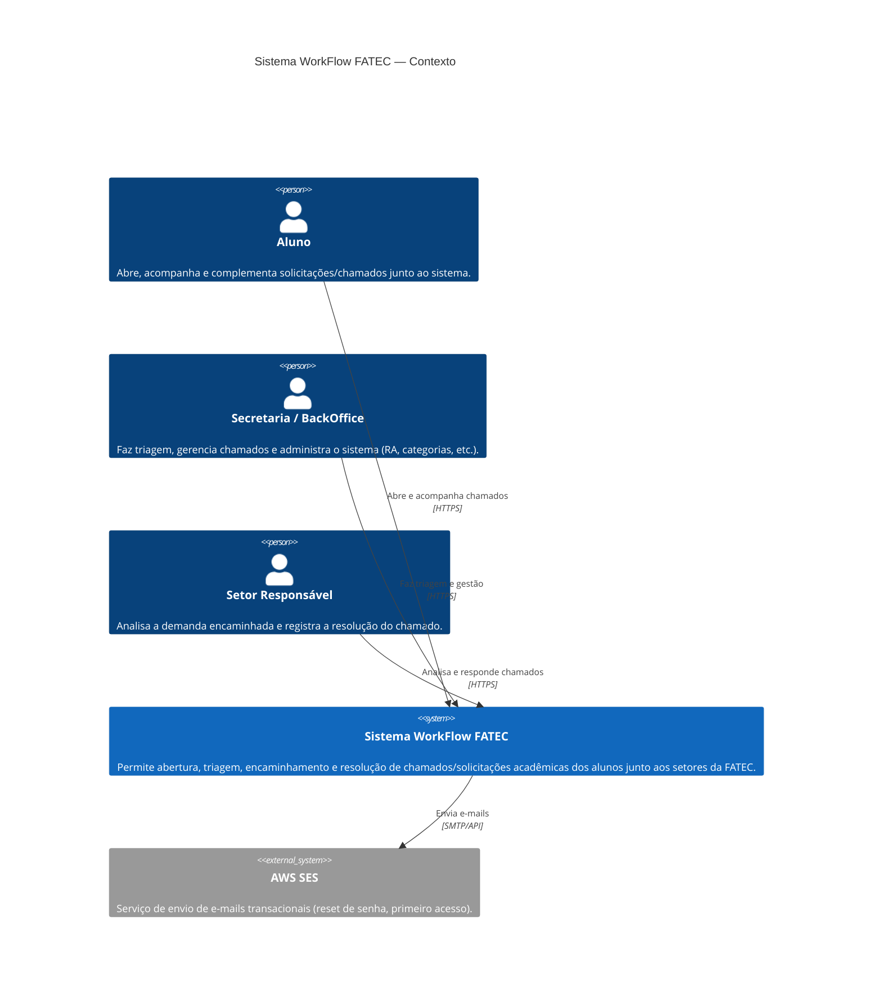

# Diagrama de Contexto — Sistema WorkFlow FATEC

```mermaid
C4Context
    title Sistema WorkFlow FATEC — Contexto

    Person(aluno, "Aluno", "Abre, acompanha e complementa solicitações/chamados junto ao sistema.")
    Person(secretaria, "Secretaria / BackOffice", "Faz triagem, gerencia chamados e administra o sistema (RA, categorias, etc.).")
    Person(setor, "Setor Responsável", "Analisa a demanda encaminhada e registra a resolução do chamado.")

    System(workflow, "Sistema WorkFlow FATEC", "Permite abertura, triagem, encaminhamento e resolução de chamados/solicitações acadêmicas dos alunos junto aos setores da FATEC.")

    System_Ext(ses, "AWS SES", "Serviço de envio de e-mails transacionais (reset de senha, primeiro acesso).")

    Rel(aluno, workflow, "Abre e acompanha chamados", "HTTPS")
    Rel(secretaria, workflow, "Faz triagem e gestão", "HTTPS")
    Rel(setor, workflow, "Analisa e responde chamados", "HTTPS")
    Rel(workflow, ses, "Envia e-mails", "SMTP/API")

    UpdateLayoutConfig($c4ShapeInRow="3", $c4BoundaryInRow="1")
```
