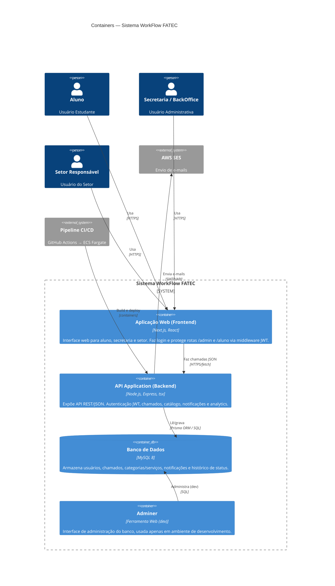

# Diagrama de Containers — Sistema WorkFlow FATEC

```mermaid
C4Container
    title Containers — Sistema WorkFlow FATEC

    Person(aluno, "Aluno", "Usuário Estudante")
    Person(secretaria, "Secretaria / BackOffice", "Usuário Administrativa")
    Person(setor, "Setor Responsável", "Usuário do Setor")

    System_Boundary(workflow, "Sistema WorkFlow FATEC") {
        Container(web, "Aplicação Web (Frontend)", "Next.js, React", "Interface web para aluno, secretaria e setor. Faz login e protege rotas /admin e /aluno via middleware JWT.")
        Container(api, "API Application (Backend)", "Node.js, Express, tsx", "Expõe API REST/JSON. Autenticação JWT, chamados, catálogo, notificações e analytics.")
        ContainerDb(db, "Banco de Dados", "MySQL 8", "Armazena usuários, chamados, categorias/serviços, notificações e histórico de status.")
        Container(adminer, "Adminer", "Ferramenta Web (dev)", "Interface de administração do banco, usada apenas em ambiente de desenvolvimento.")
    }

    System_Ext(ses, "AWS SES", "Envio de e-mails")
    System_Ext(cicd, "Pipeline CI/CD", "GitHub Actions → ECS Fargate")

    Rel(aluno, web, "Usa", "HTTPS")
    Rel(secretaria, web, "Usa", "HTTPS")
    Rel(setor, web, "Usa", "HTTPS")
    Rel(web, api, "Faz chamadas JSON", "HTTPS/fetch")
    Rel(api, db, "Lê/grava", "Prisma ORM / SQL")
    Rel(api, ses, "Envia e-mails", "SMTP/API")
    Rel(adminer, db, "Administra (dev)", "SQL")
    Rel(cicd, api, "Build e deploy", "containers")

    UpdateLayoutConfig($c4ShapeInRow="3", $c4BoundaryInRow="1")
```