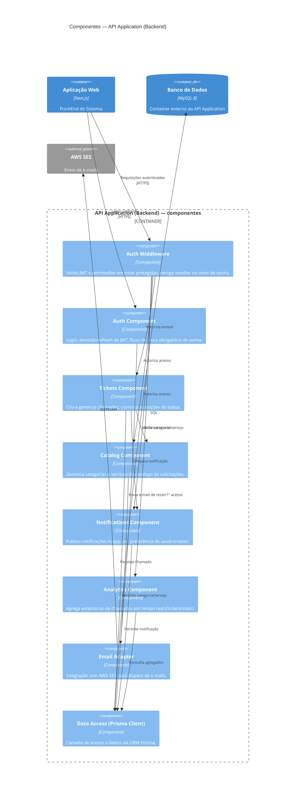

# Diagrama de Componentes — API Application (Backend)

```mermaid
C4Component
    title Componentes — API Application (Backend)

    Container(web, "Aplicação Web", "Next.js", "FrontEnd do Sistema")

    Container_Boundary(api, "API Application (Backend) — componentes") {
        Component(authMw, "Auth Middleware", "Component", "Valida JWT e permissões em rotas protegidas; revoga sessões no reset de senha.")
        Component(auth, "Auth Component", "Component", "Login, emissão/refresh de JWT, fluxo de troca obrigatória de senha.")
        Component(tickets, "Tickets Component", "Component", "Cria e gerencia chamados; controla transições de status.")
        Component(catalog, "Catalog Component", "Component", "Gerencia categorias e serviços do catálogo de solicitações.")
        Component(notif, "Notifications Component", "Component", "Publica notificações in-app por preferência de usuário/setor.")
        Component(analytics, "Analytics Component", "Component", "Agrega estatísticas de chamados em tempo real (/tickets/stats).")
        Component(email, "Email Adapter", "Component", "Integração com AWS SES para disparo de e-mails.")
        Component(data, "Data Access (Prisma Client)", "Component", "Camada de acesso a dados via ORM Prisma.")
    }

    ContainerDb(db, "Banco de Dados", "MySQL 8", "Container externo ao API Application")
    System_Ext(ses, "AWS SES", "Envio de e-mails")

    Rel(web, authMw, "Requisições autenticadas", "HTTPS")
    Rel(web, auth, "Login / refresh", "HTTPS")
    Rel(authMw, tickets, "Autoriza acesso")
    Rel(authMw, catalog, "Autoriza acesso")
    Rel(authMw, notif, "Autoriza acesso")
    Rel(authMw, analytics, "Autoriza acesso")
    Rel(tickets, catalog, "Valida categoria/serviço")
    Rel(tickets, notif, "Dispara notificação")
    Rel(auth, email, "Envia e-mail de reset/1º acesso")
    Rel(email, ses, "SMTP/API")
    Rel(tickets, data, "Persiste chamado")
    Rel(catalog, data, "Persiste categoria/serviço")
    Rel(notif, data, "Persiste notificação")
    Rel(analytics, data, "Consulta agregados")
    Rel(data, db, "SQL")

    UpdateLayoutConfig($c4ShapeInRow="4", $c4BoundaryInRow="1")
```