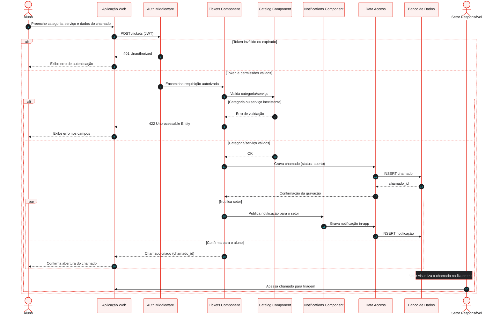

# Diagrama Dinâmico — Abertura de Chamado

```mermaid
%%{init: {
  "theme": "base",
  "themeVariables": {
    "primaryColor": "#f7d9d6",
    "primaryTextColor": "#1c1c1e",
    "primaryBorderColor": "#e8281a",
    "lineColor": "#e8281a",
    "actorBkg": "#fdf1f0",
    "actorBorder": "#e8281a",
    "actorTextColor": "#1c1c1e",
    "activationBkgColor": "#f7d9d6",
    "activationBorderColor": "#e8281a",
    "noteBkgColor": "#232326",
    "noteTextColor": "#f5f5f5",
    "noteBorderColor": "#e8281a"
  }
}}%%
sequenceDiagram
    autonumber
    actor Aluno
    participant Web as Aplicação Web
    participant Auth as Auth Middleware
    participant Tickets as Tickets Component
    participant Catalog as Catalog Component
    participant Notif as Notifications Component
    participant Data as Data Access
    participant DB as Banco de Dados
    actor Setor as Setor Responsável

    Aluno->>Web: Preenche categoria, serviço e dados do chamado
    Web->>Auth: POST /tickets (JWT)

    alt Token inválido ou expirado
        Auth-->>Web: 401 Unauthorized
        Web-->>Aluno: Exibe erro de autenticação
    else Token e permissões válidos
        Auth->>Tickets: Encaminha requisição autorizada
        Tickets->>Catalog: Valida categoria/serviço

        alt Categoria ou serviço inexistente
            Catalog-->>Tickets: Erro de validação
            Tickets-->>Web: 422 Unprocessable Entity
            Web-->>Aluno: Exibe erro nos campos
        else Categoria/serviço válidos
            Catalog-->>Tickets: OK
            Tickets->>Data: Grava chamado (status: aberto)
            Data->>DB: INSERT chamado
            DB-->>Data: chamado_id
            Data-->>Tickets: Confirmação da gravação

            par Notifica setor
                Tickets->>Notif: Publica notificação para o setor
                Notif->>Data: Grava notificação in-app
                Data->>DB: INSERT notificação
            and Confirma para o aluno
                Tickets-->>Web: Chamado criado (chamado_id)
                Web-->>Aluno: Confirma abertura do chamado
            end

            note over Setor,DB: Setor visualiza o chamado na fila de triagem
            Setor->>Web: Acessa chamado para triagem
        end
    end
```
